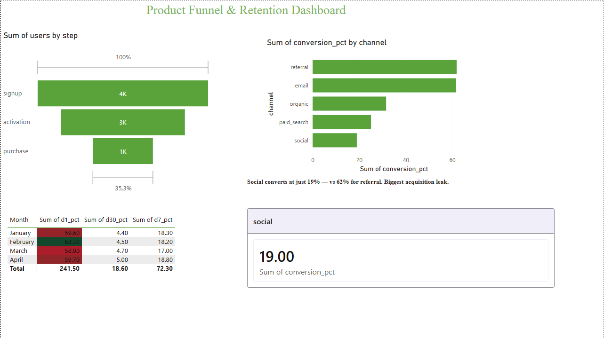

# Product Funnel & Retention Dashboard

End-to-end funnel and retention analysis on e-commerce event data — answering **where users drop off** and **who comes back**. SQL backend in DuckDB, dashboard in Power BI.

## Stack
- **SQL** (DuckDB) — conversion funnel, drop-off, cohort retention, channel segmentation
- **Power BI** — funnel chart, retention heatmap, channel comparison, biggest-leak callout

## Dataset
`events.csv` — 9,676 events across 4,000 users.
Columns: `event_id`, `user_id`, `event_name`, `event_date`, `channel`, `user_type`.
Funnel events: signup → activation → purchase.

## Key Findings

### 1. Conversion funnel
| Step | Users | Drop-off |
|------|-------|----------|
| Signup | 4,000 | — |
| Activation | 2,911 | 27% lost |
| Purchase | 1,410 | 52% of activated lost |

**Biggest leak:** activation → purchase. Over half of activated users never make a purchase.

### 2. Retention decays fast
60% of users return after day 1, but only ~18% are still active by D7 and under 5% by D30. The decay is consistent across all monthly cohorts — a systemic retention problem, not a seasonal blip.

### 3. Channel quality varies dramatically
| Channel | Conversion | D7 retention | D30 retention |
|---------|-----------|--------------|---------------|
| referral | 61.9% | 37.3% | 12.5% |
| email | 61.7% | 31.1% | 8.2% |
| organic | 31.6% | 16.1% | 2.5% |
| paid_search | 25.1% | 11.4% | 3.0% |
| social | 19.0% | 7.7% | 2.0% |

**Referral and email convert ~3.3x and retain ~6x better than social** — yet make up only ~26% of signups. Acquisition spend is concentrated in the weakest channels.

## Recommendation
Shift acquisition budget toward referral and email, audit social spend, and investigate the activation→purchase drop-off (checkout friction, pricing, or onboarding) where the largest single leak occurs.

## Files
| File | Description |
|------|-------------|
| `01_funnel.sql` | Conversion funnel by step |
| `02_retention.sql` | Cohort retention (D1/D7/D30) |
| `03_segmentation.sql` | Channel conversion + retention |
| `events.csv` | Source event data |
| `dashboard.pbix` | Power BI dashboard |
| `dashboard.png` | Dashboard screenshot |

## Tools
DuckDB · Power BI · SQL (CTEs, window functions, date functions)
